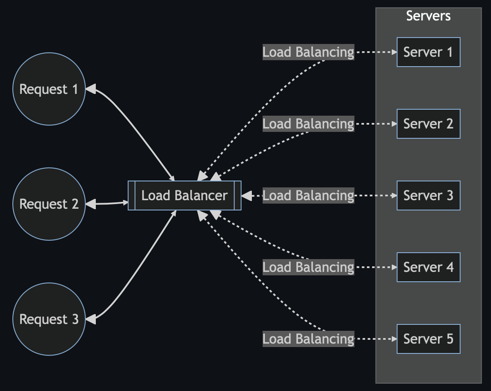

## [Introduction](https://github.com/liuliuOD/Medium/blob/main/SystemDesign/LoadBalancing/README.md)

If you've only experienced single-server services, you might be curious about what `Load Balancing` is.

`Load Balancing` is a crucial component in the realm of `distribution services`. It involves managing incoming requests to multiple servers behind the `Load Balancer`. Typically situated between clients (e.g., browsers or API users) and servers (e.g., API servers), the `Load Balancer` redirects requests from clients to servers behind it using various algorithms.

This setup helps prevent overwhelming server resources, mitigates single point of failure, and contributes to high availability and fault tolerance.
