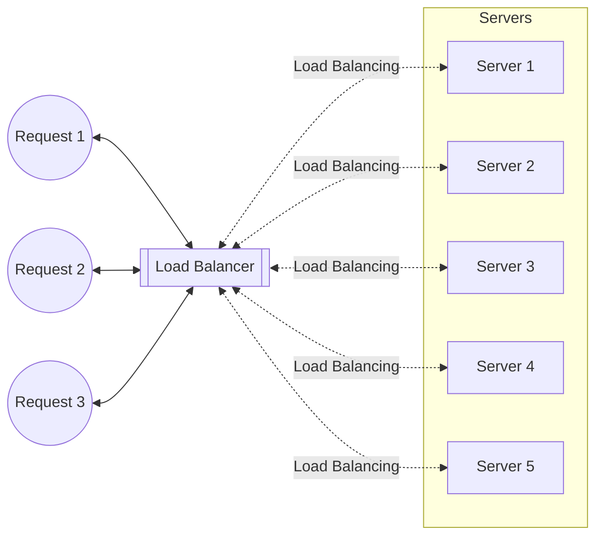

## Load Balancing

```mermaid
flowchart LR
  R1((Request 1)) <--> LB[[Load Balancer]]
  R2((Request 2)) <--> LB[[Load Balancer]]
  R3((Request 3)) <--> LB[[Load Balancer]]
  LB <-. Load Balancing .-> S1 & S2 & S3 & S4 & S5
  subgraph Servers
    direction LR
    S1[Server 1]
    S2[Server 2]
    S3[Server 3]
    S4[Server 4]
    S5[Server 5]
  end
```
